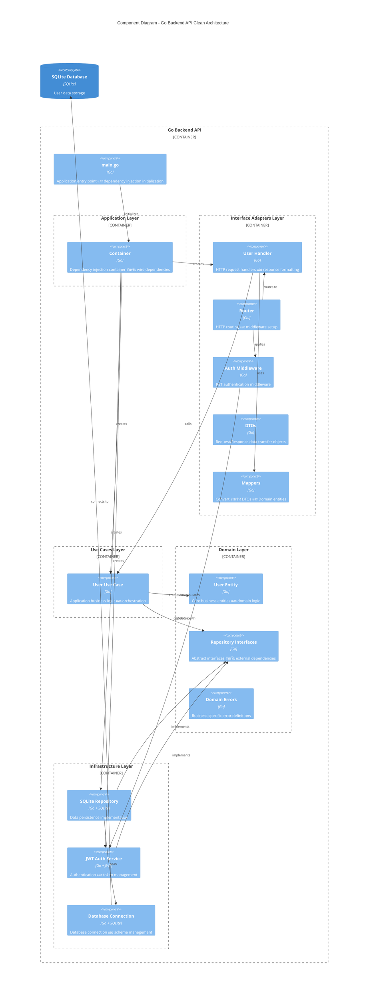
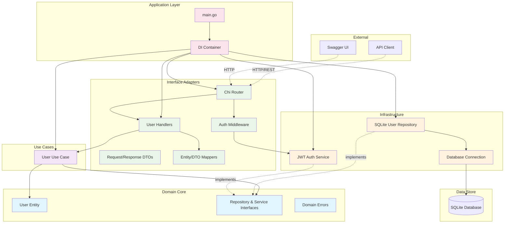
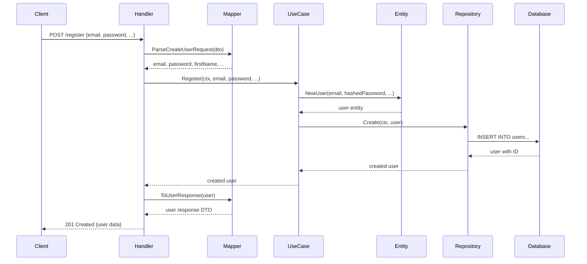
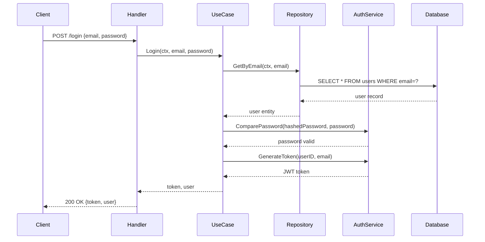
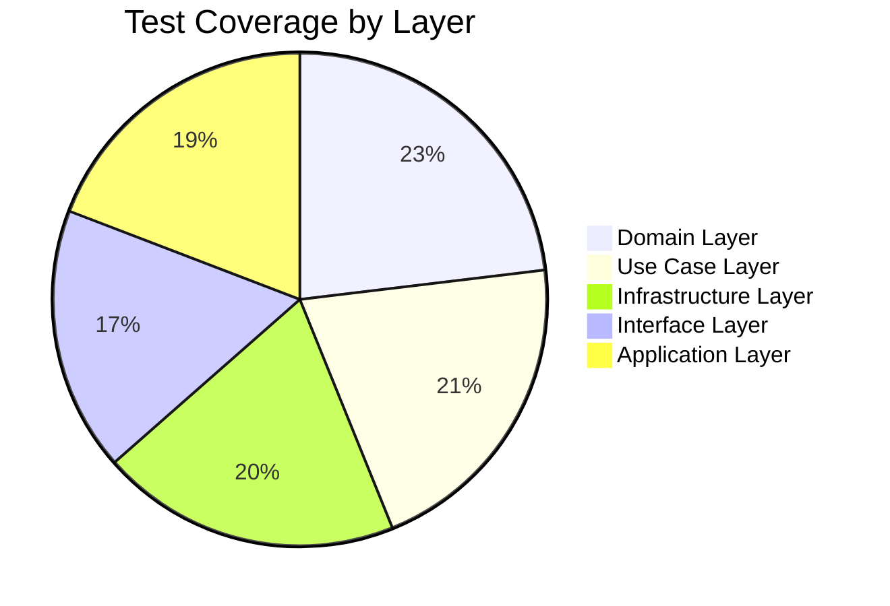

# Code Architecture Documentation

## Overview
เอกสารนี้แสดง Clean Architecture implementation ของ Go Backend API โดยใช้ C4 model เพื่ออธิบาย code structure และ component relationships

## C4 Model - Code Level Architecture

### 🏗️ Clean Architecture Layers



### 🔄 Dependency Flow Diagram



## 📁 Directory Structure และ Components

### Clean Architecture Layers Mapping

```
📦 be-test/
├── 🚀 main.go                              # Application Entry Point
├── 📁 internal/
│   ├── 🎯 app/                             # Application Layer
│   │   ├── container.go                    # DI Container
│   │   └── container_test.go               # Container Tests
│   │
│   ├── 🌟 domain/                          # Domain Layer (Core)
│   │   ├── user.go                         # User Entity + Interfaces
│   │   └── user_test.go                    # Domain Tests
│   │
│   ├── 🔄 usecase/                         # Use Cases Layer
│   │   ├── user_usecase.go                 # Business Logic
│   │   └── user_usecase_test.go            # Use Case Tests
│   │
│   ├── 🌐 interfaces/                      # Interface Adapters Layer
│   │   ├── user_handler.go                 # HTTP Handlers
│   │   ├── auth_middleware.go              # Authentication
│   │   ├── router.go                       # Route Setup
│   │   ├── dto/
│   │   │   └── user_dto.go                 # Data Transfer Objects
│   │   ├── mapper/
│   │   │   ├── user_mapper.go              # Entity/DTO Conversion
│   │   │   └── user_mapper_test.go         # Mapper Tests
│   │   └── *_test.go                       # Interface Tests
│   │
│   └── 🏗️ infrastructure/                  # Infrastructure Layer
│       ├── database.go                     # DB Connection
│       ├── user_repository.go              # Data Persistence
│       ├── auth_service.go                 # JWT Service
│       └── *_test.go                       # Infrastructure Tests
│
├── 📊 pkg/                                 # Shared Packages
│   └── config/
│       ├── config.go                       # Configuration Management
│       └── config_test.go                  # Config Tests
│
├── 📚 docs/                                # Documentation
│   ├── database.md                         # Database Schema
│   ├── architecture.md                     # This file
│   ├── c4-model/                          # C4 Model Docs
│   └── swagger.*                          # API Documentation
│
└── 🧪 tests/                              # Integration Tests
```

## 🔧 Component Responsibilities

### 1. **Application Layer** (`internal/app/`)

**Container** (`container.go`):
```go
type Container struct {
    Config      *config.Config
    Database    *sql.DB
    UserRepo    domain.UserRepository
    AuthService domain.AuthService
    UserService domain.UserService
    Router      *interfaces.Router
}
```

**Responsibilities**:
- Dependency injection และ wiring
- Application lifecycle management
- Configuration loading
- Resource cleanup

### 2. **Domain Layer** (`internal/domain/`) - **Core Business Logic**

**User Entity**:
```go
type User struct {
    ID        int
    Email     string
    Password  string
    FirstName string
    LastName  string
    Phone     string
    Birthday  time.Time
    CreatedAt time.Time
    UpdatedAt time.Time
}
```

**Interfaces**:
```go
type UserRepository interface {
    Create(ctx context.Context, user *User) error
    GetByID(ctx context.Context, id int) (*User, error)
    // ... other methods
}

type AuthService interface {
    HashPassword(password string) (string, error)
    ValidateToken(token string) (*TokenClaims, error)
    // ... other methods
}
```

**Responsibilities**:
- Core business entities
- Business rules และ validation
- Interface definitions สำหรับ external dependencies
- Domain-specific errors

### 3. **Use Cases Layer** (`internal/usecase/`) - **Application Business Logic**

**User Use Case**:
```go
type UserUseCase struct {
    userRepo    domain.UserRepository
    authService domain.AuthService
}

func (uc *UserUseCase) Register(ctx context.Context, email, password, firstName, lastName, phone string, birthday time.Time) (*domain.User, error)
func (uc *UserUseCase) Login(ctx context.Context, email, password string) (string, *domain.User, error)
func (uc *UserUseCase) GetUserProfile(ctx context.Context, userID int) (*domain.User, error)
func (uc *UserUseCase) UpdateUser(ctx context.Context, userID int, firstName, lastName, phone string, birthday *time.Time) (*domain.User, error)
```

**Responsibilities**:
- Orchestrate domain entities
- Implement application-specific business rules
- Coordinate between repositories และ services
- Handle transaction boundaries

### 4. **Interface Adapters Layer** (`internal/interfaces/`) - **External Communication**

**User Handler**:
```go
type UserHandler struct {
    userService domain.UserService
    mapper      *mapper.UserMapper
}

// HTTP Handlers
func (h *UserHandler) Register(w http.ResponseWriter, r *http.Request)
func (h *UserHandler) Login(w http.ResponseWriter, r *http.Request)
func (h *UserHandler) GetProfile(w http.ResponseWriter, r *http.Request)
func (h *UserHandler) UpdateProfile(w http.ResponseWriter, r *http.Request)
```

**DTOs**:
```go
type CreateUserRequest struct {
    Email     string `json:"email"`
    Password  string `json:"password"`
    FirstName string `json:"firstname"`
    LastName  string `json:"lastname"`
    Phone     string `json:"phone"`
    Birthday  string `json:"birthday"`
}

type UserResponse struct {
    ID        int       `json:"id"`
    Email     string    `json:"email"`
    FirstName string    `json:"firstname"`
    LastName  string    `json:"lastname"`
    Phone     string    `json:"phone"`
    Birthday  time.Time `json:"birthday"`
    CreatedAt time.Time `json:"created_at"`
    UpdatedAt time.Time `json:"updated_at"`
}
```

**Responsibilities**:
- HTTP request/response handling
- Data transformation (DTOs ↔ Entities)
- Input validation
- Authentication middleware
- Route configuration

### 5. **Infrastructure Layer** (`internal/infrastructure/`) - **External Concerns**

**SQLite Repository**:
```go
type SQLiteUserRepository struct {
    db *sql.DB
}

func (r *SQLiteUserRepository) Create(ctx context.Context, user *domain.User) error
func (r *SQLiteUserRepository) GetByEmail(ctx context.Context, email string) (*domain.User, error)
// ... other implementations
```

**JWT Auth Service**:
```go
type JWTAuthService struct {
    secret []byte
}

func (s *JWTAuthService) GenerateToken(userID int, email string) (string, error)
func (s *JWTAuthService) ValidateToken(token string) (*domain.TokenClaims, error)
// ... other implementations
```

**Responsibilities**:
- Database operations
- External service integrations
- Framework-specific implementations
- Infrastructure concerns (logging, monitoring)

## 🔀 Data Flow Examples

### User Registration Flow



### User Authentication Flow



## 🧪 Testing Architecture

### Test Coverage ตาม Layers



### Testing Strategy

**Unit Tests**:
- **Domain**: Entity business logic validation
- **Use Cases**: Business workflow testing with mocks
- **Infrastructure**: Repository และ service implementations
- **Interfaces**: HTTP handler behavior

**Integration Tests**:
- End-to-end API testing
- Database integration testing
- Authentication flow testing

## 🎯 Architecture Benefits

### ✅ **Clean Architecture Principles**

1. **Dependency Inversion**:
   - Use cases depend on domain interfaces
   - Infrastructure implements domain interfaces
   - Dependencies point inward

2. **Single Responsibility**:
   - Each layer has clear responsibility
   - Components are focused และ cohesive

3. **Open/Closed Principle**:
   - Easy to extend functionality
   - Closed for modification

4. **Interface Segregation**:
   - Small, focused interfaces
   - Clients depend only on what they use

### 🚀 **Development Benefits**

- **Testability**: Easy to unit test with mocks
- **Maintainability**: Clear separation of concerns
- **Flexibility**: Easy to swap implementations
- **Scalability**: Layer-based scaling strategies

## 🔮 Future Architecture Considerations

### Potential Enhancements

1. **Microservices Decomposition**:
   - Split into smaller services
   - Event-driven architecture

2. **CQRS Implementation**:
   - Separate read/write models
   - Event sourcing capabilities

3. **Observability**:
   - Structured logging
   - Metrics และ tracing
   - Health checks

4. **Caching Layer**:
   - Redis integration
   - Application-level caching
