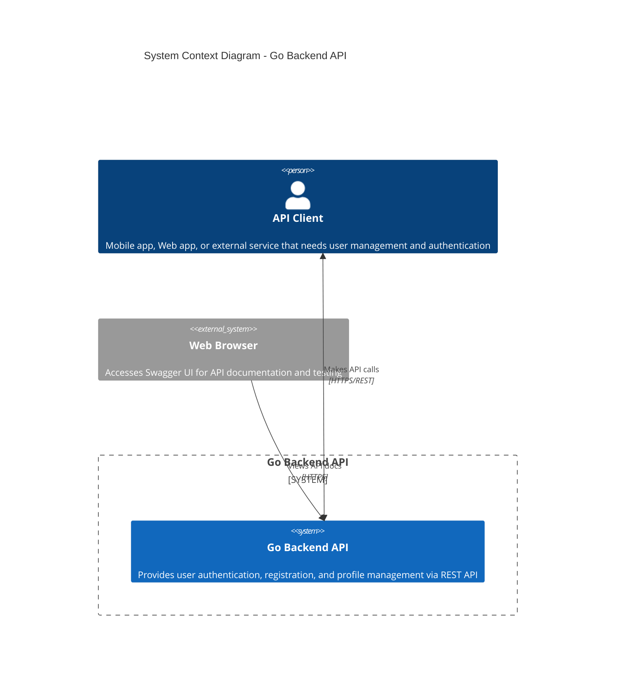

# C4 Model - Level 1: System Context Diagram

## Overview
The System Context diagram shows the Go Backend API system and how it fits into the wider world of systems and users.

## Context Diagram

## System Purpose

**Go Backend API** is a RESTful web service that provides:

### Core Features
- **User Registration**: Create new user accounts with validation
- **User Authentication**: JWT-based login system
- **User Profile Management**: Retrieve and update user information  
- **API Documentation**: Swagger UI for developers

### Key Characteristics
- **Clean Architecture**: Maintainable and testable code structure
- **Security**: JWT token-based authentication
- **Documentation**: Comprehensive API documentation via Swagger
- **Testing**: High unit test coverage across all layers

## Users and External Systems

### 👤 API Client
- **Type**: Person/System
- **Description**: Any client application that needs user management functionality
- **Examples**:
  - Mobile applications (iOS/Android)
  - Web applications (React, Vue, Angular) 
  - Other microservices
  - Third-party integrations
- **Interactions**:
  - User registration and login
  - Profile retrieval and updates
  - Authentication token management

### 🌐 Web Browser  
- **Type**: External System
- **Description**: Web browsers accessing API documentation
- **Use Cases**:
  - Developers reading API documentation
  - Testing API endpoints via Swagger UI
  - Understanding request/response formats

## System Boundaries

### What's Inside the System
- User management business logic
- Authentication and authorization
- Data validation and persistence
- API endpoint definitions
- Swagger documentation

### What's Outside the System
- Client applications (mobile, web)
- External databases (handled internally)
- Third-party authentication providers (not implemented)
- Email services (not implemented)
- File storage services (not implemented)

## Business Context

### Primary Use Cases
1. **User Onboarding**: New users can register accounts
2. **Secure Access**: Existing users can authenticate
3. **Profile Management**: Users can view and update their information
4. **Developer Integration**: Developers can understand and integrate with the API

### Quality Attributes
- **Security**: JWT-based authentication ensures secure access
- **Maintainability**: Clean Architecture enables easy modifications
- **Testability**: High test coverage ensures reliability
- **Usability**: Swagger UI provides clear API documentation
- **Performance**: Lightweight Go implementation with efficient database operations

## Technology Context

### Communication Protocols
- **HTTP/HTTPS**: REST API endpoints
- **JSON**: Request and response format
- **JWT**: Authentication token format

### Integration Points
- **Database**: SQLite for user data persistence
- **Documentation**: Swagger/OpenAPI 3.0 specification
- **Testing**: Go testing framework with mocking

## Next Level
👉 [Container Diagram](02-container.md) - Dive deeper into the system's high-level structure
