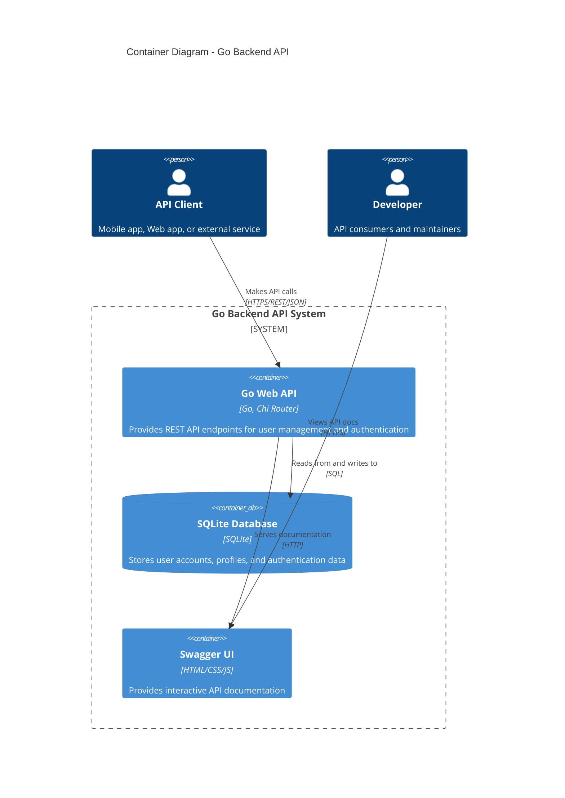

# C4 Model - Level 2: Container Diagram

## Overview
The Container diagram shows the high-level shape of the architecture and how responsibilities are distributed across containers, as well as major technology choices.

## Container Diagram



## Containers Detail

### 🚀 Go Web API
- **Technology**: Go 1.24.3, Chi Router, JWT
- **Purpose**: Core application providing REST API endpoints
- **Responsibilities**:
  - User registration and authentication
  - Profile management (CRUD operations)
  - JWT token generation and validation
  - Request validation and error handling
  - Business logic orchestration

**Key Features**:
- Clean Architecture implementation
- JWT-based authentication
- Comprehensive input validation
- Structured error responses
- High unit test coverage

**Port**: `3333` (configurable via environment)

### 🗄️ SQLite Database
- **Technology**: SQLite 3
- **Purpose**: Primary data store for all application data
- **Data Stored**:
  - User accounts (email, hashed passwords)
  - User profiles (name, phone, birthday)
  - Audit information (created_at, updated_at)

**Schema Overview**:
```sql
users (
    id INTEGER PRIMARY KEY,
    email TEXT UNIQUE NOT NULL,
    password TEXT NOT NULL,
    firstname TEXT NOT NULL,
    lastname TEXT NOT NULL,
    phone TEXT NOT NULL,
    birthday DATE NOT NULL,
    created_at DATETIME DEFAULT CURRENT_TIMESTAMP,
    updated_at DATETIME DEFAULT CURRENT_TIMESTAMP
)
```

**Indexes**:
- Primary key on `id`
- Unique index on `email`
- Index on `created_at` for performance

### 📚 Swagger UI
- **Technology**: OpenAPI 3.0, Swagger UI HTML/CSS/JS
- **Purpose**: Interactive API documentation
- **Features**:
  - Complete API endpoint documentation
  - Request/response examples
  - Authentication testing (JWT Bearer tokens)
  - Schema definitions for all DTOs
  - Try-it-out functionality

**Access**: `http://localhost:3333/swagger/`

## Technology Choices

### Backend Stack
- **Runtime**: Go 1.24.3
- **HTTP Router**: Chi - lightweight and fast
- **Database Driver**: `github.com/mattn/go-sqlite3`
- **Authentication**: JWT with `github.com/golang-jwt/jwt/v5`
- **Password Hashing**: bcrypt
- **Documentation**: Swagger with `github.com/swaggo/swag`

### Architecture Patterns
- **Clean Architecture**: Separation of concerns across layers
- **Dependency Injection**: Container pattern for service wiring
- **Repository Pattern**: Data access abstraction
- **DTO Pattern**: Request/response data transfer objects

### Testing Framework
- **Unit Testing**: Go built-in testing package
- **Mocking**: Custom mock implementations
- **Coverage**: Comprehensive coverage across all layers

## Data Flow

### 1. User Registration Flow
```
API Client → Go Web API → Validation → Password Hashing → SQLite Database
```

### 2. User Authentication Flow  
```
API Client → Go Web API → Credential Validation → JWT Generation → Response
```

### 3. Profile Management Flow
```
API Client → Go Web API → JWT Validation → Business Logic → SQLite Database
```

### 4. Documentation Access Flow
```
Developer → Go Web API → Swagger UI → Static Files
```

## Deployment Architecture

### Single Container Deployment
- **Deployment Unit**: Single Go binary
- **Database**: Embedded SQLite file
- **Configuration**: Environment variables
- **Startup**: Dependency injection container initialization

### Environment Configuration
```bash
SERVER_HOST=0.0.0.0          # Default: 0.0.0.0
SERVER_PORT=3333             # Default: 3333  
DB_DRIVER=sqlite3            # Default: sqlite3
DB_DSN=./app.db             # Default: ./app.db
JWT_SECRET=your-secret-key   # Required for production
```

## Security Considerations

### Authentication & Authorization
- **JWT Tokens**: Stateless authentication
- **Password Security**: bcrypt hashing with salt
- **Token Expiration**: 24-hour token lifetime
- **Protected Endpoints**: Middleware-based protection

### Data Security
- **Input Validation**: Comprehensive request validation
- **SQL Injection Prevention**: Parameterized queries
- **Error Handling**: No sensitive data in error responses

## Scalability Considerations

### Current Limitations
- Single instance deployment
- SQLite file-based storage
- No horizontal scaling capability

### Future Scaling Options
- Replace SQLite with PostgreSQL/MySQL
- Add Redis for session storage
- Implement load balancing
- Add containerization (Docker)

## Quality Attributes

### Performance
- **Lightweight**: Go binary with minimal dependencies
- **Fast Startup**: Quick container initialization
- **Efficient Database**: SQLite for small to medium loads

### Maintainability  
- **Clean Architecture**: Clear layer separation
- **High Test Coverage**: Comprehensive unit tests
- **Documentation**: Complete API documentation

### Reliability
- **Error Handling**: Structured error responses
- **Input Validation**: Comprehensive request validation
- **Testing**: High coverage ensures stability

## Next Level
👉 [Component Diagram](03-component.md) - Explore the internal structure of the Go Web API
