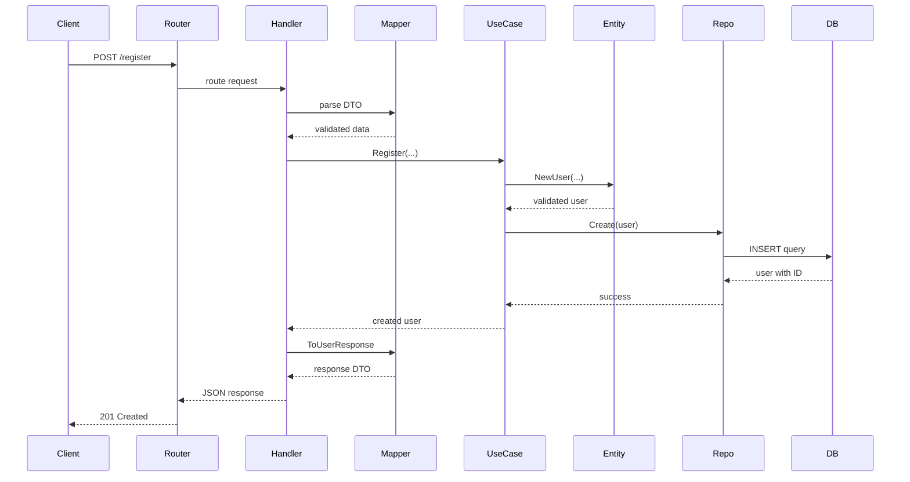
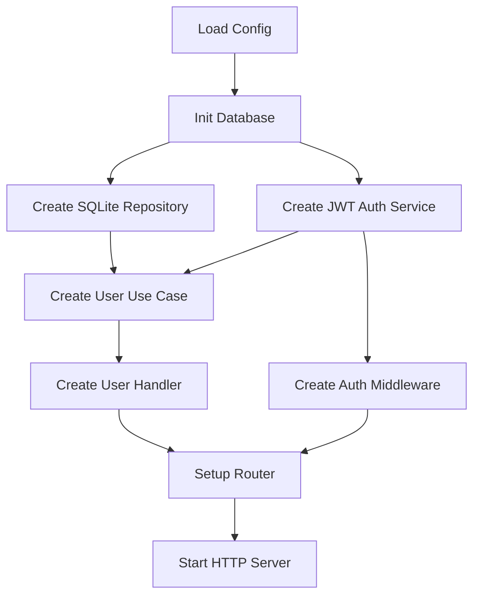

# C4 Model - Level 3: Component Diagram

## Overview
Component diagram แสดงโครงสร้างภายในของ Go Web API container และแสดงให้เห็น Clean Architecture layers และ component relationships

## Component Diagram

```mermaid
C4Component
    title Component Diagram - Go Backend API Internal Structure

    Container_Boundary(web_api, "Go Web API Container") {
        
        Component_Ext(http_client, "HTTP Client", "External", "API consumers, Mobile apps, Web apps")
        
        Container_Boundary(interface_layer, "Interface Adapters Layer") {
            Component(router, "Chi Router", "Go, Chi", "HTTP routing, middleware pipeline, CORS handling")
            Component(auth_middleware, "Auth Middleware", "Go, JWT", "JWT token validation, user context injection")
            Component(user_handler, "User Handler", "Go", "HTTP request/response handling, input validation")
            Component(dto_mapper, "DTO Mapper", "Go", "Convert entities ↔ DTOs, date parsing, validation")
            Component(dto_package, "DTOs", "Go Structs", "Request/Response data structures")
        }
        
        Container_Boundary(usecase_layer, "Use Cases Layer") {
            Component(user_usecase, "User Use Case", "Go", "Business logic orchestration, workflow management")
        }
        
        Container_Boundary(domain_layer, "Domain Layer") {
            Component(user_entity, "User Entity", "Go Struct", "Core business entity with validation methods")
            Component(repository_interface, "User Repository Interface", "Go Interface", "Data access contract")
            Component(auth_interface, "Auth Service Interface", "Go Interface", "Authentication contract")
            Component(service_interface, "User Service Interface", "Go Interface", "Business service contract")
            Component(domain_errors, "Domain Errors", "Go", "Business-specific error definitions")
        }
        
        Container_Boundary(infrastructure_layer, "Infrastructure Layer") {
            Component(sqlite_repo, "SQLite User Repository", "Go, SQLite", "Database operations, SQL queries")
            Component(jwt_service, "JWT Auth Service", "Go, JWT", "Token generation/validation, password hashing")
            Component(database_conn, "Database Connection", "Go, SQLite", "Connection management, schema creation")
        }
        
        Container_Boundary(app_layer, "Application Layer") {
            Component(di_container, "DI Container", "Go", "Dependency injection, service wiring")
            Component(config, "Configuration", "Go", "Environment variables, app settings")
        }
    }
    
    ContainerDb(sqlite_db, "SQLite Database", "SQLite File", "User data, indexes")
    
    %% External relationships
    Rel(http_client, router, "HTTP requests", "HTTPS/REST")
    
    %% Interface layer relationships
    Rel(router, auth_middleware, "applies to protected routes", "")
    Rel(router, user_handler, "routes requests to", "HTTP")
    Rel(auth_middleware, jwt_service, "validates tokens", "")
    Rel(user_handler, dto_mapper, "converts data", "")
    Rel(user_handler, user_usecase, "calls business logic", "")
    Rel(dto_mapper, dto_package, "uses structures", "")
    
    %% Use case relationships
    Rel(user_usecase, user_entity, "creates/manipulates", "")
    Rel(user_usecase, repository_interface, "depends on", "Interface")
    Rel(user_usecase, auth_interface, "depends on", "Interface")
    
    %% Domain relationships
    Rel(user_entity, domain_errors, "may return", "")
    
    %% Infrastructure relationships  
    Rel(sqlite_repo, repository_interface, "implements", "")
    Rel(jwt_service, auth_interface, "implements", "")
    Rel(sqlite_repo, database_conn, "uses", "")
    Rel(database_conn, sqlite_db, "connects to", "SQL")
    
    %% Application relationships
    Rel(di_container, config, "loads", "")
    Rel(di_container, router, "wires", "")
    Rel(di_container, user_handler, "creates", "")
    Rel(di_container, user_usecase, "creates", "")
    Rel(di_container, sqlite_repo, "creates", "")
    Rel(di_container, jwt_service, "creates", "")
```



## Component Details

### 🌐 Interface Adapters Layer

#### Chi Router
- **Purpose**: HTTP request routing และ middleware management
- **Technologies**: Go Chi router
- **Responsibilities**:
  - Route definition และ HTTP method mapping
  - Middleware pipeline (CORS, logging, authentication)
  - Static file serving (Swagger UI)
  - Request/response lifecycle management

#### Auth Middleware  
- **Purpose**: JWT token validation และ user context injection
- **Technologies**: Go, JWT library
- **Key Functions**:
  ```go
  func (m *AuthMiddleware) Middleware(next http.Handler) http.Handler
  ```
- **Process Flow**:
  1. Extract Bearer token from Authorization header
  2. Validate JWT signature และ expiration
  3. Extract user claims (ID, email)
  4. Inject user context into request
  5. Pass to next handler หรือ return 401

#### User Handler
- **Purpose**: HTTP request/response handling สำหรับ user operations
- **Key Endpoints**:
  ```go
  // Public endpoints
  POST /register    - User registration
  POST /login       - User authentication
  GET  /            - Health check
  
  // Protected endpoints (require JWT)
  GET  /me          - Get user profile
  PUT  /me          - Update user profile
  ```
- **Response Format**:
  ```json
  {
    "message": "Success",
    "data": { ... }
  }
  ```

#### DTO Mapper
- **Purpose**: Data transformation ระหว่าง domain entities และ HTTP DTOs
- **Key Methods**:
  ```go
  func (m *UserMapper) ToUserResponse(user *domain.User) dto.UserResponse
  func (m *UserMapper) ParseCreateUserRequest(req dto.CreateUserRequest) (...)
  func (m *UserMapper) ParseUpdateUserRequest(req dto.UpdateUserRequest) (...)
  ```

### 🎯 Use Cases Layer

#### User Use Case
- **Purpose**: Application business logic orchestration
- **Key Operations**:
  ```go
  func (uc *UserUseCase) Register(ctx, email, password, ...) (*User, error)
  func (uc *UserUseCase) Login(ctx, email, password) (string, *User, error)  
  func (uc *UserUseCase) GetUserProfile(ctx, userID) (*User, error)
  func (uc *UserUseCase) UpdateUser(ctx, userID, ...) (*User, error)
  ```
- **Business Rules**:
  - Email uniqueness validation
  - Password hashing ก่อน storage
  - User profile data integrity
  - Authentication workflow

### 🌟 Domain Layer

#### User Entity
- **Purpose**: Core business entity พร้อม validation
- **Structure**:
  ```go
  type User struct {
      ID        int
      Email     string
      Password  string
      FirstName string
      LastName  string
      Phone     string
      Birthday  time.Time
      CreatedAt time.Time
      UpdatedAt time.Time
  }
  ```
- **Business Methods**:
  ```go
  func NewUser(...) (*User, error)           // Factory with validation
  func (u *User) GetFullName() string        // Business logic
  func (u *User) IsValidForUpdate() error    // Validation rules
  ```

#### Interfaces
- **Repository Interface**: Abstract data access
  ```go
  type UserRepository interface {
      Create(ctx context.Context, user *User) error
      GetByID(ctx context.Context, id int) (*User, error)
      GetByEmail(ctx context.Context, email string) (*User, error)
      Update(ctx context.Context, user *User) error
      Delete(ctx context.Context, id int) error
      Exists(ctx context.Context, email string) (bool, error)
  }
  ```

- **Auth Service Interface**: Abstract authentication
  ```go
  type AuthService interface {
      HashPassword(password string) (string, error)
      ComparePassword(hashedPassword, password string) error
      GenerateToken(userID int, email string) (string, error)
      ValidateToken(token string) (*TokenClaims, error)
  }
  ```

### 🏗️ Infrastructure Layer

#### SQLite User Repository
- **Purpose**: Database operations implementation
- **Key Features**:
  - CRUD operations with proper error handling
  - SQL injection prevention ด้วย parameterized queries
  - Transaction support
  - Database-specific error mapping to domain errors

#### JWT Auth Service  
- **Purpose**: Authentication service implementation
- **Features**:
  - bcrypt password hashing (cost 10)
  - JWT token generation with expiration (24h)
  - Token validation with signature verification
  - Secure secret key management

#### Database Connection
- **Purpose**: Database connection และ schema management
- **Responsibilities**:
  - SQLite connection initialization
  - Schema creation และ migration
  - Index management for performance
  - Connection lifecycle management

### 🎯 Application Layer

#### DI Container
- **Purpose**: Dependency injection และ service wiring
- **Container Structure**:
  ```go
  type Container struct {
      Config      *config.Config
      Database    *sql.DB
      UserRepo    domain.UserRepository
      AuthService domain.AuthService
      UserService domain.UserService
      Router      *interfaces.Router
  }
  ```
- **Lifecycle**:
  1. Load configuration
  2. Initialize database connection
  3. Create infrastructure services
  4. Wire use cases
  5. Setup HTTP router
  6. Start server

## Component Interactions

### Request Flow Example: User Registration



### Dependency Injection Flow



## Quality Attributes

### 🔒 Security Components
- **JWT Middleware**: Token-based authentication
- **Password Hashing**: bcrypt with proper cost
- **Input Validation**: DTO validation และ sanitization
- **SQL Injection Prevention**: Parameterized queries

### 🚀 Performance Components  
- **Database Indexing**: Optimized queries
- **Connection Pooling**: Efficient resource usage
- **Lightweight Router**: Chi router with minimal overhead
- **Stateless Authentication**: JWT tokens

### 🧪 Testability Components
- **Interface Abstractions**: Easy mocking
- **Dependency Injection**: Isolated testing
- **Layer Separation**: Unit testing per layer
- **Mock Implementations**: Comprehensive test coverage

## Next Level
👉 [Code Diagram](04-code.md) - Explore detailed class relationships และ implementation details
