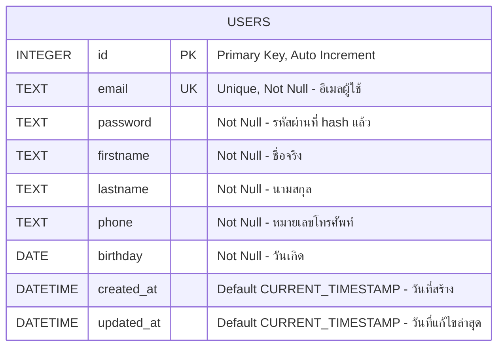
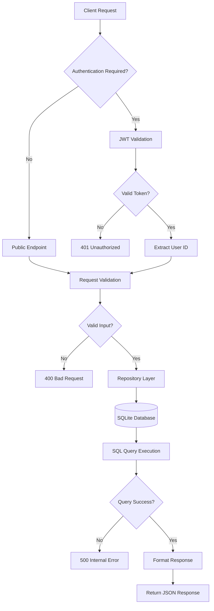

# Database Schema Documentation

## Overview
ระบบ Go Backend API ใช้ SQLite เป็น database หลักสำหรับเก็บข้อมูลผู้ใช้ โดยมีการออกแบบ schema ที่เรียบง่ายแต่มีประสิทธิภาพ

## Entity Relationship Diagram (ERD)



## Database Schema Details

### 📋 USERS Table

**Purpose**: เก็บข้อมูลผู้ใช้ทั้งหมดในระบบ

| Column | Type | Constraints | Description |
|--------|------|-------------|-------------|
| `id` | INTEGER | PRIMARY KEY, AUTO_INCREMENT | รหัสผู้ใช้เฉพาะ |
| `email` | TEXT | UNIQUE, NOT NULL | อีเมลผู้ใช้ (ใช้สำหรับ login) |
| `password` | TEXT | NOT NULL | รหัสผ่านที่เข้ารหัสด้วย bcrypt |
| `firstname` | TEXT | NOT NULL | ชื่อจริงของผู้ใช้ |
| `lastname` | TEXT | NOT NULL | นามสกุลของผู้ใช้ |
| `phone` | TEXT | NOT NULL | หมายเลขโทรศัพท์ |
| `birthday` | DATE | NOT NULL | วันเกิดของผู้ใช้ |
| `created_at` | DATETIME | DEFAULT CURRENT_TIMESTAMP | วันเวลาที่สร้างบัญชี |
| `updated_at` | DATETIME | DEFAULT CURRENT_TIMESTAMP | วันเวลาที่แก้ไขข้อมูลล่าสุด |

### 🔐 Security Features

**Password Hashing**:
- ใช้ bcrypt algorithm
- Salt rounds มาตรฐาน (cost 10)
- ไม่เก็บ plain text password

**Email Uniqueness**:
- UNIQUE constraint บน email column
- ป้องกันการสร้างบัญชีซ้ำ

### 📊 Database Indexes

```sql
-- Primary Key (อัตโนมัติ)
CREATE INDEX IF NOT EXISTS sqlite_autoindex_users_1 ON users(id);

-- Email Index (สำหรับ login performance)
CREATE INDEX IF NOT EXISTS idx_users_email ON users(email);

-- Created At Index (สำหรับ sorting และ reporting)
CREATE INDEX IF NOT EXISTS idx_users_created_at ON users(created_at);
```

### 🗄️ Table Creation SQL

```sql
CREATE TABLE IF NOT EXISTS users (
    id INTEGER PRIMARY KEY AUTOINCREMENT,
    email TEXT UNIQUE NOT NULL,
    password TEXT NOT NULL,
    firstname TEXT NOT NULL,
    lastname TEXT NOT NULL,
    phone TEXT NOT NULL,
    birthday DATE NOT NULL,
    created_at DATETIME DEFAULT CURRENT_TIMESTAMP,
    updated_at DATETIME DEFAULT CURRENT_TIMESTAMP
);

-- Indexes
CREATE INDEX IF NOT EXISTS idx_users_email ON users(email);
CREATE INDEX IF NOT EXISTS idx_users_created_at ON users(created_at);
```

## Data Flow Architecture

### 🔄 CRUD Operations Flow



### 📝 Repository Pattern Implementation

**Interface Layer** (Domain):
```go
type UserRepository interface {
    Create(ctx context.Context, user *User) error
    GetByID(ctx context.Context, id int) (*User, error)
    GetByEmail(ctx context.Context, email string) (*User, error)
    Update(ctx context.Context, user *User) error
    Delete(ctx context.Context, id int) error
    Exists(ctx context.Context, email string) (bool, error)
}
```

**Implementation Layer** (Infrastructure):
```go
type SQLiteUserRepository struct {
    db *sql.DB
}
```

## Sample Data Examples

### User Registration Example
```json
{
  "email": "john.doe@example.com",
  "password": "securePassword123",
  "firstname": "John",
  "lastname": "Doe",
  "phone": "0812345678",
  "birthday": "1990-01-15"
}
```

### Database Record After Hashing
```sql
INSERT INTO users VALUES (
    1,
    'john.doe@example.com',
    '$2a$10$N9qo8uLOickgx2ZMRZoMye...', -- bcrypt hash
    'John',
    'Doe',
    '0812345678',
    '1990-01-15',
    '2025-08-27 10:30:00',
    '2025-08-27 10:30:00'
);
```

## Performance Considerations

### 🚀 Optimization Strategies

1. **Indexing**:
   - Email index สำหรับ login queries
   - Created_at index สำหรับ sorting

2. **Query Optimization**:
   - ใช้ prepared statements
   - Parameterized queries เพื่อป้องกัน SQL injection

3. **Connection Management**:
   - Connection pooling (ถ้าจำเป็น)
   - Proper connection lifecycle management

### 📈 Scalability Considerations

**Current Limitations**:
- SQLite เหมาะสำหรับ small to medium applications
- Single-file database
- Limited concurrent write operations

**Future Migration Path**:
- PostgreSQL สำหรับ production scale
- Redis สำหรับ session caching
- Database clustering สำหรับ high availability

## Backup and Maintenance

### 💾 Backup Strategy
```bash
# SQLite backup
sqlite3 app.db ".backup backup_$(date +%Y%m%d_%H%M%S).db"

# Or copy file
cp app.db "backup_$(date +%Y%m%d_%H%M%S).db"
```

### 🔧 Maintenance Tasks
- Regular integrity checks: `PRAGMA integrity_check;`
- Vacuum database: `VACUUM;` (เพื่อ optimize file size)
- Analyze statistics: `ANALYZE;` (เพื่อ update query planner stats)

## Security Best Practices

### 🛡️ Data Protection
1. **Password Security**: bcrypt hashing with proper cost
2. **SQL Injection Prevention**: Parameterized queries
3. **Data Validation**: Input validation ก่อน database operations
4. **Access Control**: Repository pattern ซ่อน direct database access

### 🔒 Compliance Considerations
- GDPR: User data deletion capability
- Data retention policies
- Audit trail (created_at, updated_at timestamps)
